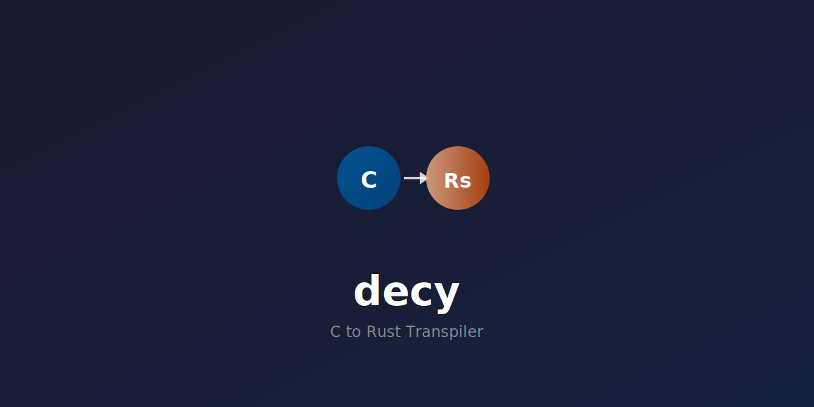

<div align="center">



<p align="center">
  <a href="https://crates.io/crates/decy"></a>
  <a href="https://docs.rs/decy"></a>
  <a href="https://opensource.org/licenses/MIT"></a>
</p>

<p align="center">
  
  
  
  
</p>

</div>

---

## Table of Contents

- [Quick Start](#quick-start)
- [Quality Metrics](#quality-metrics-pmat)
- [Installation](#installation)
- [Usage](#usage)
- [Features](#features)
- [Architecture](#architecture)
- [Unsafe Minimization](#unsafe-minimization)
- [Development](#development)
- [Documentation](#documentation)
- [Contributing](#contributing)
- [License](#license)

---

## Quick Start

```bash
# Transpile a C file to Rust
decy transpile input.c -o output.rs

# Transpile an entire project
decy transpile-project src/ -o rust_output/

# Audit unsafe code
decy audit output.rs
```

**Example:**

```c
// input.c
int add(int a, int b) {
    return a + b;
}
```

```bash
decy transpile input.c
```

```rust
// Generated Rust (no unsafe!)
fn add(a: i32, b: i32) -> i32 {
    a + b
}
```

---

## Quality Metrics (PMAT)

| Metric | Score | Target |
|--------|-------|--------|
| **Rust Project Score** | 92.9% (A+) | 90%+ |
| **Repository Health** | 84.5/100 (B+) | 80+ |
| **Test Coverage** | 95.1% | 80%+ |
| **Test Pass Rate** | 99.9% | 100% |
| **Clippy Warnings** | 0 | 0 |

Run quality analysis:

```bash
pmat rust-project-score
pmat repo-score
pmat analyze complexity
```

---

## Installation

### From crates.io (Recommended)

```bash
cargo install decy
```

### From Source

```bash
git clone https://github.com/paiml/decy.git
cd decy
make install   # Installs Rust + LLVM/Clang
cargo install --path crates/decy
```

### Requirements

- **Rust**: 1.70+ (stable)
- **LLVM/Clang**: 14+ (for C parsing)
- **Platform**: Linux, macOS, Windows (WSL2)

---

## Usage

### Transpile a Single File

```bash
decy transpile input.c -o output.rs
```

### Transpile with Compilation Verification

```bash
decy transpile input.c --verify -o output.rs
```

### Differential Testing (S5)

Compile original C with gcc and transpiled Rust with rustc, run both, and compare outputs:

```bash
decy diff-test input.c
decy diff-test input.c --timeout 10
```

### Transpile an Entire Project

```bash
decy transpile-project src/ -o rust_output/
decy check-project src/       # Verify build order
decy cache-stats src/          # View cache performance
```

### Interactive REPL

```bash
decy repl
```

---

## Features

### Core Transpilation

```bash
# Single file
decy transpile input.c -o output.rs

# Project with caching (10-20x faster on unchanged files)
decy transpile-project src/ -o rust_output/
decy cache-stats src/
```

### Debug & Visualization

```bash
# Visualize C AST
decy debug --visualize-ast input.c

# Visualize ownership inference
decy debug --visualize-ownership input.c

# Step-through debugging
decy debug --step-through input.c
```

### Safety Analysis

```bash
# Audit unsafe blocks
decy audit output.rs --verbose

# Generate verification book
decy verify --book-output ./book
```

### MCP Integration

```bash
# Start MCP server for Claude Code
decy mcp-server --port 3000
```

---

## Architecture

```
C Source → Parser → HIR → Analyzer → Ownership → Codegen → Rust
             │         │       │          │          │
           clang    Rust-IR  Types   &T/&mut T    Safe code
```

### Crates

| Crate | Description |
|-------|-------------|
| `decy-parser` | C AST parsing (clang-sys) |
| `decy-hir` | High-level IR (Rust-oriented) |
| `decy-analyzer` | Static analysis, type inference |
| `decy-ownership` | Ownership inference (pointers → references) |
| `decy-codegen` | Rust code generation |
| `decy-verify` | Safety verification |
| `decy-debugger` | AST/HIR visualization |
| `decy` | CLI binary |

---

## Unsafe Minimization

Decy uses a 4-phase approach to minimize unsafe code:

| Phase | Reduction | Technique |
|-------|-----------|-----------|
| 1. Pattern-Based | 100% → 50% | `malloc/free` → `Box`, arrays → `Vec` |
| 2. Ownership | 50% → 20% | Infer `&T`, `&mut T` from usage |
| 3. Lifetime | 20% → 10% | Infer `<'a, 'b>` annotations |
| 4. Safe Wrappers | 10% → <5% | Generate safe abstractions |

**Target:** <5 unsafe blocks per 1000 LOC

---

## Development

### EXTREME TDD Workflow

```bash
# RED: Write failing tests
git commit -m "[RED] DECY-XXX: Add failing tests"

# GREEN: Minimal implementation
git commit -m "[GREEN] DECY-XXX: Implement feature"

# REFACTOR: Meet quality gates
git commit -m "[REFACTOR] DECY-XXX: Clean up"
```

### Quality Gates

```bash
make quality-gates   # Run all checks
make test            # Run tests
make coverage        # Generate coverage report
```

### Running Tests

```bash
cargo test --workspace          # All tests
cargo test -p decy-ownership    # Single crate
cargo llvm-cov --workspace      # Coverage
```

---

## Documentation

- **[Getting Started](GETTING_STARTED.md)** - Developer guide
- **[Specification](docs/specifications/decy-spec-v1.md)** - Technical spec
- **[Unsafe Strategy](docs/specifications/decy-unsafe-minimization-strategy.md)** - How we reduce unsafe
- **[Roadmap](roadmap.yaml)** - Development plan

---

## Contributing

Contributions are welcome! Please follow the EXTREME TDD workflow:

1. **Pick a ticket** from `roadmap.yaml` (or create one)
2. **RED**: Write failing tests first (`git commit --no-verify -m "[RED] DECY-XXX: ..."`)
3. **GREEN**: Implement minimal solution to pass tests
4. **REFACTOR**: Meet quality gates (`make quality-gates`)

### Quality Requirements

- All tests must pass (`cargo test --workspace`)
- Zero clippy warnings (`cargo clippy --workspace -- -D warnings`)
- Coverage >= 80% (`cargo llvm-cov --workspace`)
- No SATD comments (TODO, FIXME, HACK, etc.)

### Getting Started

```bash
make install       # Install dependencies
make build         # Build workspace
make test          # Run all tests
make quality-gates # Run all checks
```

See [GETTING_STARTED.md](GETTING_STARTED.md) for detailed developer setup.

---

## License

MIT OR Apache-2.0

---

## Acknowledgments

- **[C2Rust](https://github.com/immunant/c2rust)** - Mozilla's C-to-Rust transpiler
- **[PMAT](https://github.com/paiml/pmat)** - Quality metrics toolkit
- **Toyota Production System** - Quality principles
- 🤖 [Coursera Hugging Face AI Development Specialization](https://www.coursera.org/specializations/hugging-face-ai-development) - Build Production AI systems with Hugging Face in Pure Rust

---

<div align="center">
<b>Built with EXTREME quality standards</b>
</div>
